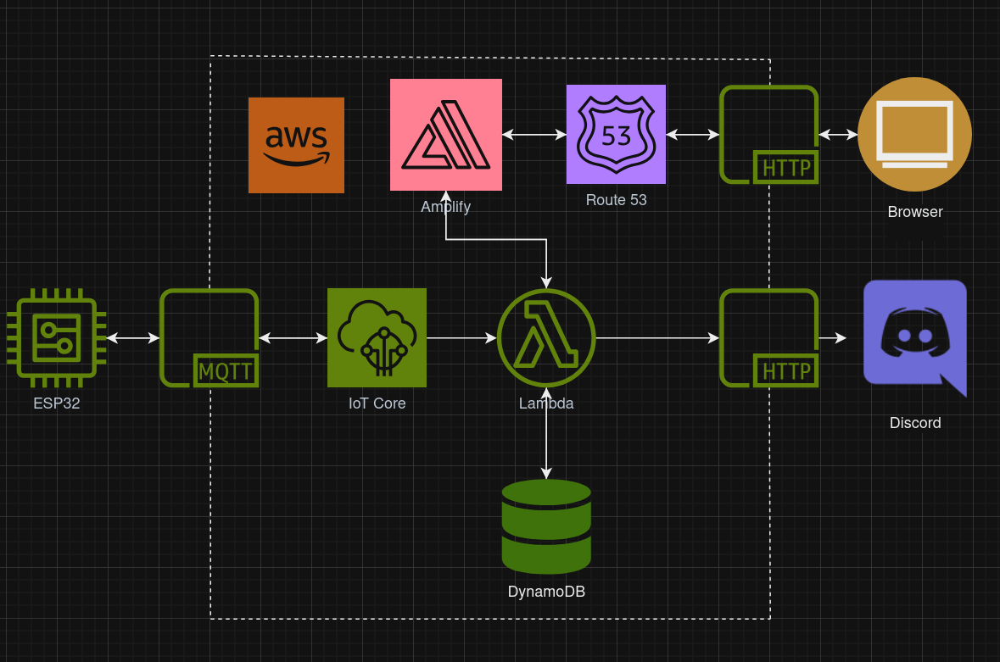
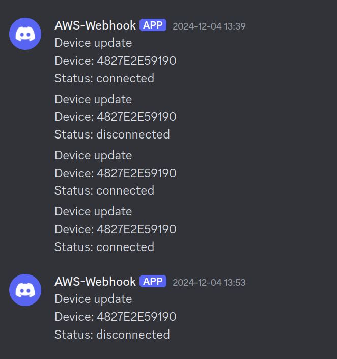
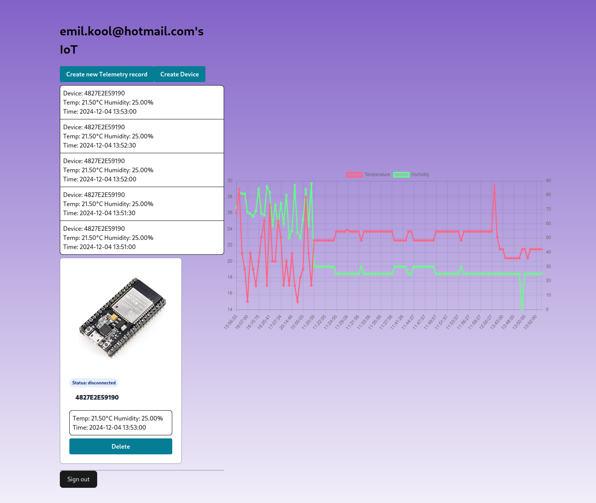

## IoT service using AWS IoT Core

This is a simple implementation of a IoT project that measures temperature and humidity using a ESP32 (Any hardware that can use MQTT is usable). It features a secure MQTT connection using the built in functions of IoT Core with the option of disabling devices if you no longer trust them. For frontend it uses Amplify to keep within the AWS ecosystem. 

## Goal
The goal of the excercie was to get more familiar with cloud tools and more AWS in general and I feel like its been worthwhile thing to learn since it automates a lot of the process, especially the scalability part of it. Theres obviously the downsides with costs and being dependend on their ecosystem compared to a cloud solution where you depend on your own containers or even self hosting it. They've also made it easy to integrate all their different services as long as you know what to look for. 

## Flowchart


## Setup
### ESP32
ESP setup can be found [here](https://github.com/Cosmao/esp32IoTCore)
### Amplify

#### Deploying to AWS
For detailed instructions on deploying your application, refer to the [deployment section](https://docs.amplify.aws/react/start/quickstart/#deploy-a-fullstack-app-to-aws) of our documentation.
#### Specific steps after deploying
We need to set our secrets so that amplify can use our newly created graphQL api and DiscordWebhook. Firstly we need to go to `AWS AppSync`, you should see your newly created graphQL API there. Go into settings and copy both the graphQL endpoint and API key. After you got those values go to `Hosting > Secrets` in the amplify dashboard and make 3 enviroment variables:
 - `CUSTOM_LAMBDA_GRAPHQL_ENDPOINT`
 - `CUSTOM_LAMBDA_GRAPHQL_KEY`
 - `CUSTOM_DISCORD_ENDPOINT`

Paste in your API Key and endpoint there.

#### Custom domain
If you have a custom domain hosted by AWS you can simply use the `Hosting > Custom domains` and pick the one you want to use in the provided dropdown.

#### Discord webhook
Go to your discord servers settings and find the Integration tab. Simply add another webhook and copy the endpoint you're given. Paste the endpoint into the `CUSTOM_DSCORD_ENDPOINT` variable inside amplify.

### IoT Core
#### Security policy
The first thing we want to do in IoT Core is creating a policy under security, this is the one I use.
```json
{
  "Version": "2012-10-17",
  "Statement": [
    {
      "Effect": "Allow",
      "Action": "iot:Connect",
      "Resource": "arn:aws:iot:<YOUR-AWS-REGION>:<YOUR-AWS-ID>:client/${iot:Connection.Thing.ThingName}"
    },
    {
      "Effect": "Allow",
      "Action": "iot:Subscribe",
      "Resource": [
        "arn:aws:iot:<YOUR-AWS-REGION>:<YOUR-AWS-ID>:topicfilter/${iot:Connection.Thing.ThingName}/downlink",
        "arn:aws:iot:<YOUR-AWS-REGION>:<YOUR-AWS-ID>:topicfilter/$aws/things/${iot:Connection.Thing.ThingName}/shadow/*"
      ]
    },
    {
      "Effect": "Allow",
      "Action": [
        "iot:Publish",
        "iot:Receive"
      ],
      "Resource": [
        "arn:aws:iot:<YOUR-AWS-REGION>:<YOUR-AWS-ID>:topic/$aws/things/${iot:Connection.Thing.ThingName}/shadow/*",
        "arn:aws:iot:<YOUR-AWS-REGION>:<YOUR-AWS-ID>:topic/${iot:Connection.Thing.ThingName}/downlink",
        "arn:aws:iot:<YOUR-AWS-REGION>:<YOUR-AWS-ID>:topic/${iot:Connection.Thing.ThingName}/telemetry"
      ]
    }
  ]
}

```
You need to change the server region and AWS ID to your own.
This will limit the topics that devices are allowed to subscribe to and post to, all of this is to increase the security for our solution.
#### Connecting a ESP32
Once this is done we can connect our ESP32 using the `Manage > All devices > Things > Create Thing` in IoT Core. Select unnamed shadow and the name to be the same as the ESP32's MAC address. Once this is done you should be able to see messages in the `MQTT test client` in IoT Core by subcribing to `#`.
#### Message rules
Head to `Message routing > Rules > Create Rule` \
First one will will create is to send the telemetry data to amplify and dynamoDB using graphQL. Use the following SQL statement.
```SQL
SELECT *, clientId() AS device_id, timestamp() AS timestamp FROM "+/telemetry"
```
Select the rule action as `Lambda` and search for `CoreTelemetry` it will show up once you've depolyed your amplify solution. \

Next we will create the rule for online/offline devices. Start by creating another rule with the following SQL statement.
```SQL
SELECT *, clientID() AS device_id FROM "$aws/events/presence/+/+"
```
Select the `Lambda` action again and search for `CoreStatus` and select it. Then create another action and select `Lambda` and search for DiscordWebhook. The first action will handle our database and website connection to keep the status updated there. DiscordWebhook will send a notification when the state changes to your selected channel.

## Storage
For any sort of long time storage we'd better move older data away from dynamoDB into a S3 bucket or similar. You can easily set up S3 backups of old data through the dynamoDB page on AWS. You'd have several options and can even do it in different tiers for older and older data depending on how often you need to access them.

## Security
All communication is encrypted with keys geneated by AWS through IoT core or with API keys for the graphQL API. One thing that noteworth is that everything I've done is with the root account which generally is frowned upon. You'd do better by making users with the least amount of privilege needed for the tasks its supposed to do so any sort of hack/leak would do minimal damage. On the ESP32 front you'd best burn in the certificates so they are harder for an attacker to extract.

## Notes
Since we are on AWS we get scalability for "free" so we should be able to support a massive amount of devices and users of the front end as long as we can pay the AWS bill. Good practice would be to create users with the IAM system inside AWS so you dont have to use the root user which generally is a bad idea but for a short demo it does work.

## Images
### Discord webhook

### Website



## Debugging
If it doesnt work you can always check cloudwatch for any relevant logs that might help you out.

## License

This library is licensed under the MIT-0 License. See the LICENSE file.
